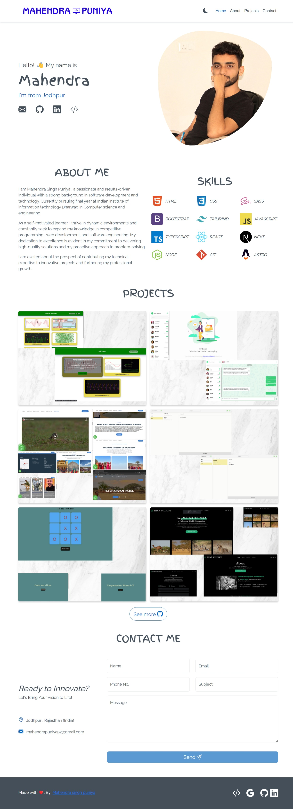
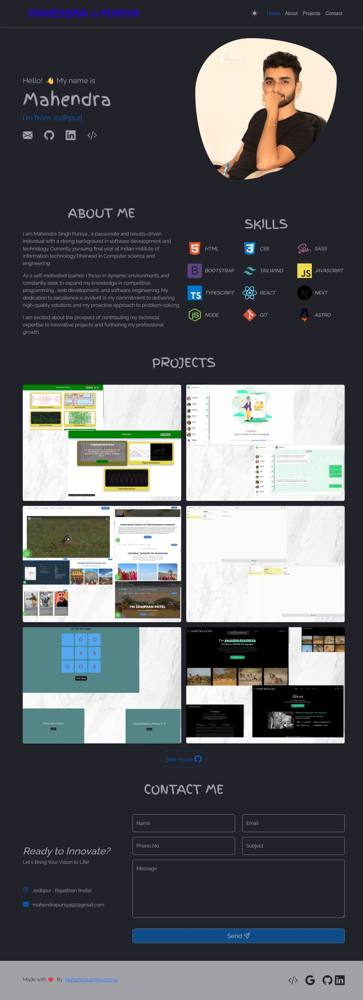

<h1 align="center">Mahendra Singh Puniya </h1>

**Website :** visit [https://trendy-timber-online-store.netlify.app/](www.trendy-timber-online-store.netlify.app/)
<p align ="center" >
</img>


</p>

## Technology Used 🛠️

- [Astro](https://astro.build/) - web framework
- [SASS](https://sass-lang.com) - CSS Preprocessor
- [Bootstrap](https://getbootstrap.com) - CSS Framework
- [Bootstrap-icons](https://icons.getbootstrap.com) - Icons Library
- [Curtains js](https://www.curtainsjs.com) - WebGL JS Library
- [Typed js](https://mattboldt.github.io/typed.js) - JS Library For Typed Effect
- [AOS js](https://michalsnik.github.io/aos) - JS Library For Scroll Animation

## Project Structure 📂

```
├── public
│ │ ├── img
│ │ ├── favicon.svg
├── src
│ ├── assets
│ │ ├── sass
│ │ ├── js
│ ├── components
│ ├── pages
│ └── data.json
├── LICENSE
├── .gitignore
├── astro.config.mjs
├── pnpm-lock.yaml
├── package.json
└── tsconfig.json
├── README.md
```


## Getting Started with This Template

To start  this project  , follow these steps :

- **Fork Repository:**

<!-- 2. **Edit Template:**

   - Modify the `data.json` file and include your images. -->
<!-- 
3. **Set Up Contact Form:**

   Ensure the contact form functionality:

   - Create accounts on [Email.js](https://emailjs.com) and [IP Registry](https://ipregistry.co).
   - Create a `.env` file in the project root with the following variables:
     ```env
     PUBLIC_EMAILJS_ID=your_emailjs_id
     PUBLIC_CONTACT_SERVICE=your_contact_service
     PUBLIC_TEMPLATE_ID=your_template_id
     PUBLIC_IP_API_KEY=your_ip_api_key
     ```
   - Replace `your_emailjs_id`, `your_contact_service`, `your_template_id`, and `your_ip_api_key` with your actual values. -->

- **Install Dependencies & Run Project:**

```
pnpm install

pnpm dev
```

<!-- 5. **Deployment**

You can easily deploy with [Vercel](https://vercel.com) or [Netlify](https://netlify.com).

🎉 By following these steps, you'll be able to customize, run, and deploy this template effectively. -->


<div align="center" >
<p>Light-Mode</p>

<p>Dark-Mode</p>


</div> 
<br>

## **Contributing**

Contributions are welcomed, for further modifications, improvements, or any questions, feel free to reach out to me via -

- **Email:** [mahendrapuniya92@gmail.com](mailto:mahendrapuniya92@gmail.com)
- **Portfolio:** [www.MahendraPuniya.com](https://mahendra-pooniya.netlify.app/)
- **LinkedIn:** [www.linkedin.com/in/pooniyamahendra](https://www.linkedin.com/in/pooniyamahendra/)
- **Leet-code:** [www.leetcode.com/mahendra92/](https://leetcode.com/mahendra92/)
- **Git-hub:** [www.github.com/mahendra2811](https://github.com/mahendra2811)

## License 📄

This project is licensed under the MIT License - see the [LICENSE.md](./LICENSE) file for details.

## Sponsor 💛

Give a ⭐ if you like my portfolio project! and contact us directly for any project.

```

```
<!-- src="https://res.cloudinary.com/ddu4msir9/image/upload/v1727198136/mahendra3_keanqt.jpg" -->